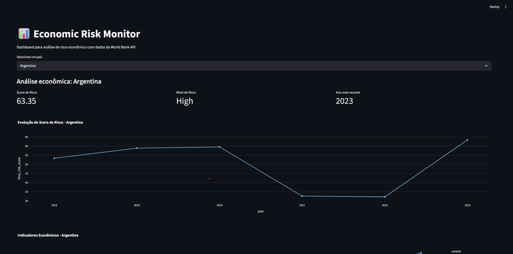
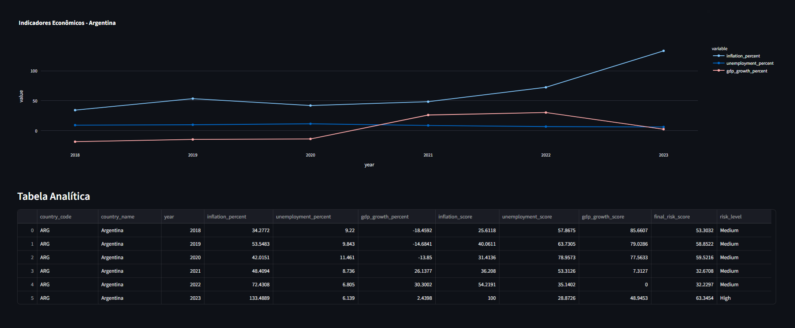

# 📊 Economic Risk Monitor

Pipeline de dados econômicos utilizando arquitetura Medallion (RAW → SILVER → GOLD) para análise de risco entre países.

## 🎯 Objetivo

Extrair indicadores econômicos da **World Bank API**, processar em camadas de qualidade crescente e disponibilizar dashboard interativo para análise de risco econômico.

---

## 🏗️ Arquitetura

O projeto segue a **Medallion Architecture** com 3 camadas:

```
World Bank API  →  RAW (Bronze)  →  SILVER  →  GOLD  →  Dashboard
                   JSON bruto      Limpo     Analítico  Streamlit
```

### Camadas de Dados

| Camada | Descrição | Localização |
|--------|-----------|-------------|
| **RAW** | Dados brutos da API sem modificação | `data/raw/` + tabela `raw_world_bank_responses` |
| **SILVER** | Dados limpos, validados e padronizados | `data/silver/` + tabela `silver_world_bank_indicators` |
| **GOLD** | Dados agregados prontos para análise | `data/gold/` + tabelas `gold_country_summary` e `gold_economic_risk_score` |

---

## 📁 Estrutura do Projeto

```text
worldbank-api/
│
├── data/
│   ├── raw/
│   │   └── world_bank/              # JSONs brutos extraídos da API
│   ├── silver/
│   │   └── world_bank_indicators.csv
│   ├── gold/
│   │   ├── country_summary.csv
│   │   └── economic_risk_score.csv
│   └── database/
│       └── economic_risk.db
│
├── dashboards/
│   └── economic_dashboard.py        # Dashboard Streamlit
├── img/
│   ├── monitor.png                  # Print do dashboard
│   └── indicadoreseconomicos.png    # Print dos indicadores
├── logs/
├── sql/
│   └── create_table.sql             # Criação das tabelas SQLite
├── src/
│   ├── analysis/
│   │   └── risk_calculator.py
│   ├── extract/
│   │   └── world_bank_extractor.py
│   ├── load/
│   │   ├── database.py
│   │   └── load_to_database.py
│   └── transform/
│       ├── raw_to_silver.py
│       └── silver_to_gold.py
├── tests/
│   ├── conftest.py
│   ├── test.quality.py
│   ├── test_extractor.py
│   ├── test_risk_calculator.py
│   └── test_transformer.py
├── .gitignore
├── config.py
├── main.py
├── README.MD
└── requirements.txt
```

---

## 🔧 Tecnologias

- **Python 3.11+**
- **pandas** - Manipulação de dados
- **requests** - Chamadas HTTP para API
- **SQLite** - Banco de dados
- **Streamlit** - Dashboard interativo
- **Plotly** - Visualizações gráficas

---

## 📈 Indicadores Econômicos

| Código | Indicador |
|--------|-----------|
| `NY.GDP.MKTP.CD` | PIB (US$ corrente) |
| `NY.GDP.PCAP.CD` | PIB per capita |
| `FP.CPI.TOTL.ZG` | Inflação (%) |
| `SL.UEM.TOTL.ZS` | Desemprego (%) |
| `SP.POP.TOTL` | População total |

**Países analisados:** Brasil, Estados Unidos, Argentina, Alemanha, China  
**Período:** 2010-2023

---

## 🚀 Como Usar

### 1. Instalar dependências

```bash
pip install -r requirements.txt
```

### 2. Executar pipeline completo

```bash
python main.py
```

Este comando irá:
- ✅ Extrair dados da World Bank API
- ✅ Salvar JSONs brutos em `data/raw/`
- ✅ Limpar e validar dados (camada Silver)
- ✅ Agregar métricas (camada Gold)
- ✅ Calcular scores de risco econômico
- ✅ Carregar tudo no SQLite

### 3. Visualizar dashboard

```bash
streamlit run dashboards/economic_dashboard.py
```

### 4. Rodar testes (opcional)

```bash
pytest tests/
```

---

## 📊 Dashboard

O dashboard Streamlit oferece:

- 🔍 Filtro por país
- 📈 Gráfico temporal do score de risco econômico
- 📊 Comparativo de indicadores (inflação, desemprego, PIB)
- 📋 Tabela analítica com todos os dados
- 🎯 Classificação de risco (Low / Medium / High)

### Print do Dashboard

Capturas atuais do dashboard:




---

## 🎲 Cálculo do Risk Score

O score de risco econômico (0-100) é calculado com base em:

```python
risk_score = (
    inflation_score * 0.4 +      # Peso 40%
    unemployment_score * 0.3 +   # Peso 30%
    gdp_growth_score * 0.3       # Peso 30%
)
```

**Classificação:**
- **Low Risk:** score ≤ 30
- **Medium Risk:** 30 < score ≤ 60
- **High Risk:** score > 60

---

## 🗄️ Banco de Dados

O projeto utiliza **SQLite** com 4 tabelas:

1. `raw_world_bank_responses` - Respostas brutas da API
2. `silver_world_bank_indicators` - Indicadores limpos
3. `gold_country_summary` - Resumo por país/ano
4. `gold_economic_risk_score` - Scores de risco calculados

Scripts SQL disponíveis em `/sql/`:
- `create_tables.sql` - Criação das tabelas
- `queries_silver.sql` - Consultas camada Silver
- `queries_gold.sql` - Consultas camada Gold

---

## 🎯 Padrões de Código

- ✅ **POO** - Classes para cada responsabilidade
- ✅ **Type hints** - Todas as funções tipadas
- ✅ **Logging** - Sistema centralizado de logs
- ✅ **Clean Code** - Código legível e documentado
- ✅ **Separação de camadas** - RAW → SILVER → GOLD
- ✅ **SQL separado** - Scripts SQL fora do Python

---

## 📝 Exemplo de Uso

```python
from src.extract.world_bank_extractor import WorldBankExtractor
from src.transform.raw_to_silver import RawToSilverTransformer

# Extrair dados
extractor = WorldBankExtractor()
extractor.extract_all()

# Transformar para Silver
transformer = RawToSilverTransformer()
transformer.run()
```

---

## 🤝 Contribuindo

Este é um projeto de portfólio, mas sugestões são bem-vindas! Abra uma issue ou envie um PR.

---

## 📄 Licença

MIT License - Projeto educacional/portfólio

---

## 👤 Autor

**Samuel** - Estudante de Ciência da Computação  
Especialização: Engenharia de Dados e Cybersecurity

---

**⭐ Se este projeto foi útil, considere dar uma estrela no GitHub!**
